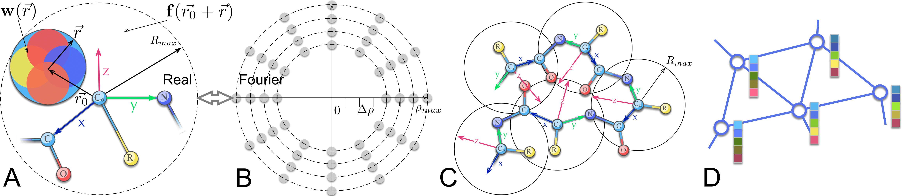

# 6DCNN for Volumetric Data Processing

<div align="center">
  
</div>
Method presented at Paper Title: "6DCNN with roto-translational convolution filters for volumetric data processing" at AAAI 2022.

**Authors:** Dmitrii Zhemchuzhnikov, Ilia Igashov, Sergei Grudinin

**Affiliation:** Univ. Grenoble Alpes, CNRS, Grenoble INP, LJK, 38000 Grenoble, France

The paper is available at [AAAI Digital Library](https://ojs.aaai.org/index.php/AAAI/article/view/18668).

## Abstract
6DCNN is designed to address the challenges of processing volumetric data, utilizing SE(3)-equivariant message-passing and nonlinear activation operations constructed in the Fourier space. This approach reduces computational complexity and improves the efficiency of recognizing spatial patterns. The model has been evaluated on several datasets from recent CASP protein structure prediction challenges, demonstrating significant improvements over baseline architectures and state-of-the-art methods.


## Installation
To install the required dependencies, run the following command:
```bash
git clone https://gricad-gitlab.univ-grenoble-alpes.fr/GruLab/6dcnn
cd fgcnn
pip install .
```

## Citation
If you use this implementation or build upon it, please cite the original paper:

``` bibtex
@inproceedings{zhemchuzhnikov20226dcnn,
  title={6DCNN with roto-translational convolution filters for volumetric data processing},
  author={Zhemchuzhnikov, Dmitrii and Igashov, Ilia and Grudinin, Sergei},
  booktitle={Proceedings of the AAAI Conference on Artificial Intelligence},
  volume={36},
  number={4},
  pages={4707--4715},
  year={2022}
}
```

## License
This project is licensed under the GNU General Public License v3.0 - see the LICENSE file for details.